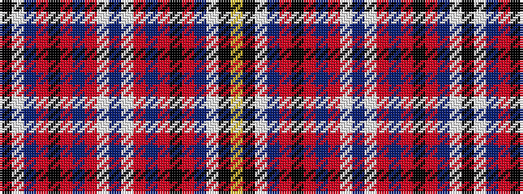

KWBRKRBRWBWRBRKRBWKY

It is a 20 stripe tartan.

<figure class="pat-woven">

<figcaption>idealised sample</figcaption>
</figure>

## Colour Sequence



## Tartans with this colour sequence

| Tartans |
|---------------|
| [Hart (Texas) (Personal)](/setts/s20/ly4k3w2db7r7k4r5db4r30w2db3~x2/)|
||
