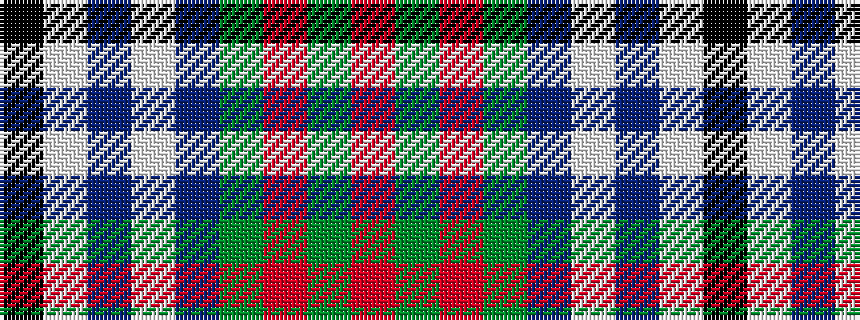

KWBWBGRGR

It is a 9 stripe tartan.

<figure class="pat-woven">

<figcaption>idealised sample</figcaption>
</figure>

## Colour Sequence



## Tartans with this colour sequence

| Tartans |
|---------------|
| [Antigonish Centennial](/setts/s9/k4lb2db5lb7db9g14o4g1o4~x2/)|
||
