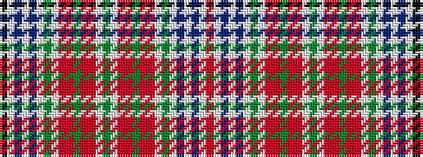

KWBWBWGWRRGRRWGWRRGRRWGWBWBWR

It is a 29 stripe tartan.

<figure class="pat-woven">

<figcaption>idealised sample</figcaption>
</figure>

## Colour Sequence



## Tartans with this colour sequence

| Tartans |
|---------------|
| [MacBean, Meta (Personal)](/setts/s29/k6w40t5w2t5w5g12w5r5ri5g2ri5r5w5g10w5r5ri5g2ri5r5w5g12w5t5w2t5w40r6~x2/)|
||
| [MacBean, Meta..](/setts/s29/k6w40t5w2t5w5g12w5r5m5g2m5r5w5g10w5r5m5g2m5r5w5g12w5t5w2t5w40r6~x2/)|
||
