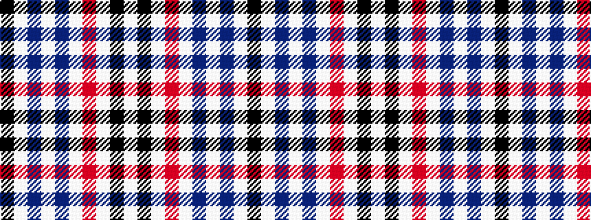

KWBWBWRWKW

It is a 10 stripe tartan.

<figure class="pat-woven">

<figcaption>idealised sample</figcaption>
</figure>

## Colour Sequence



## Tartans with this colour sequence

| Tartans |
|---------------|
| [Dijkgraaf, Markus Jack (Personal)](/variants/s10/w5k5w10r2w10dp8w15dp8lb3k3~x2/)|
||
