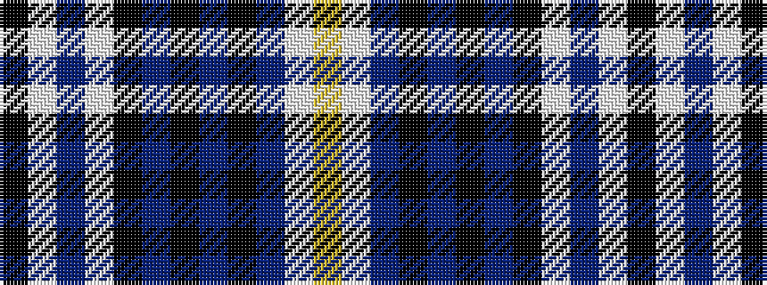

KWBWKBKBKBWY

It is a 12 stripe tartan.

<figure class="pat-woven">

<figcaption>idealised sample</figcaption>
</figure>

## Colour Sequence



## Tartans with this colour sequence

| Tartans |
|---------------|
| [Goodwin, Robert Richard (Personal)](/variants/s12/k5lb2b10lb2k5db15k2db15k5db10lb1ly2~x2/)|
||
