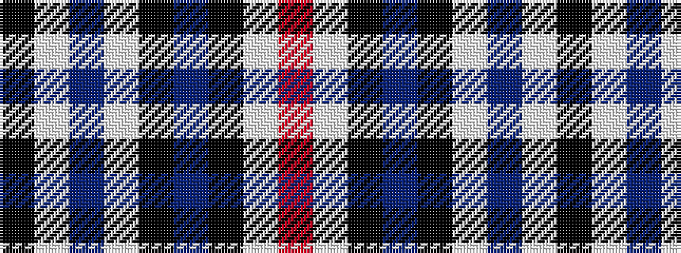

KWBWKBKWR

It is a 9 stripe tartan.

<figure class="pat-woven">

<figcaption>idealised sample</figcaption>
</figure>

## Colour Sequence



## Tartans with this colour sequence

| Tartans |
|---------------|
| [Provincewide HOG Chapter](/setts/s9/k50w1n15w1k40n13k62w4r21~x2/)|
||
| [Savannah Harley Davidson (Corporate)](/setts/s9/k25w1n3w1k31n3k31w2o9~x2/)|
||
