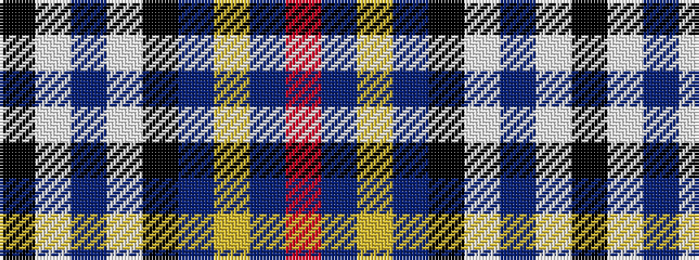

KWBWKBYBR

It is a 9 stripe tartan.

<figure class="pat-woven">

<figcaption>idealised sample</figcaption>
</figure>

## Colour Sequence



## Tartans with this colour sequence

| Tartans |
|---------------|
| [Inverness Cathedral (Corporate)](/setts/s9/r72db6ly1db12k4w1n4w1k5~x2/)|
||
