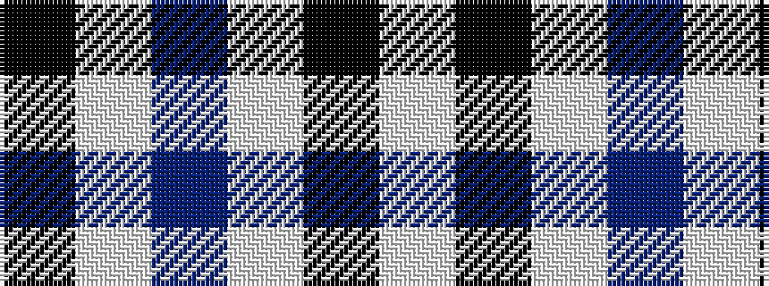

KWBWKW

It is a 6 stripe tartan.

<figure class="pat-woven">

<figcaption>idealised sample</figcaption>
</figure>

## Colour Sequence



## Tartans with this colour sequence

| Tartans |
|---------------|
| [Ikelman No 1](/setts/s6/w8k16w2db2w1k1~x4/)|
||
