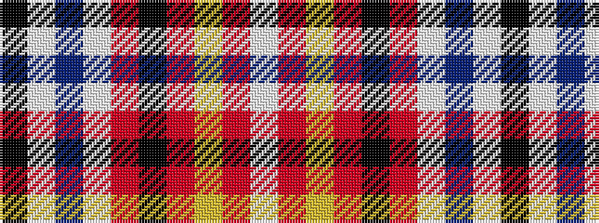

KWBWRKRYRW

It is a 10 stripe tartan.

<figure class="pat-woven">

<figcaption>idealised sample</figcaption>
</figure>

## Colour Sequence



## Tartans with this colour sequence

| Tartans |
|---------------|
| [Blaylock](/variants/s10/k4w2db8w3r16k2r5ly2r5w2~x2/)|
||
