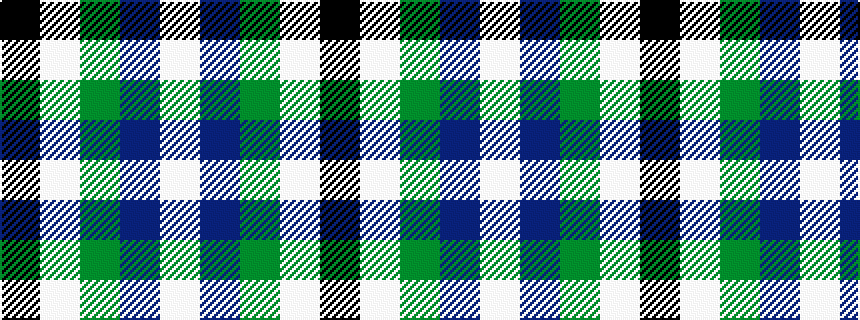

KWGBW

It is a 5 stripe tartan.

<figure class="pat-woven">

<figcaption>idealised sample</figcaption>
</figure>

## Colour Sequence



## Tartans with this colour sequence

| Tartans |
|---------------|
| [Bhatti](/variants/s5/k7lt3dg18db18w2~x2/)|
||
| [Bhatti (Name)](/variants/s5/k7lb3g18db18w2~x2/)|
||
| [Douglas](/variants/s5/k2lb2dg8db8lb1/)|
||
| [Douglas](/variants/s5/k2lt2g8db8w1~x2/)|
||
| [Douglas Green](/variants/s5/k4lb2dg8db8lb1/)|
||
