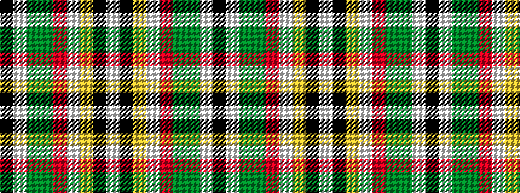

KWGGRWYKW

It is a 9 stripe tartan.

<figure class="pat-woven">

<figcaption>idealised sample</figcaption>
</figure>

## Colour Sequence



## Tartans with this colour sequence

| Tartans |
|---------------|
| [Leaf Peeper](/variants/s9/k2w1dg25dy11r12w1lo12k1w2~x2/)|
||
| [Leaf Peeper](/variants/s9/k2w1dg25dy11r12w1ly12k1w2~x2/)|
||
