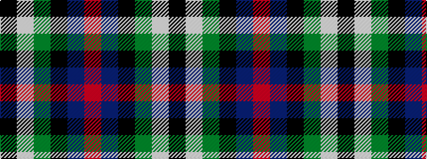

KWGKBR

It is a 6 stripe tartan.

<figure class="pat-woven">

<figcaption>idealised sample</figcaption>
</figure>

## Colour Sequence



## Tartans with this colour sequence

| Tartans |
|---------------|
| [Rose Hunting](/setts/k4w1g10k10db10r2/)|
||
| [Rose White Dress](/variants/s6/r24n4k4g4w13k2~x4/)|
||
| [Rose, White dress](/variants/s6/r32db6k6g6w18k3/)|
||
