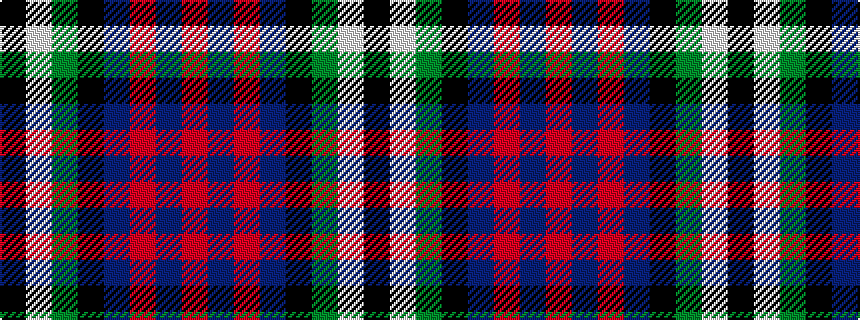

KWGKBRBR

It is a 8 stripe tartan.

<figure class="pat-woven">

<figcaption>idealised sample</figcaption>
</figure>

## Colour Sequence



## Tartans with this colour sequence

| Tartans |
|---------------|
| [Purves (2014)](/setts/s8/ki4w1dg12k3db16r1db1r1~x2/)|
||
