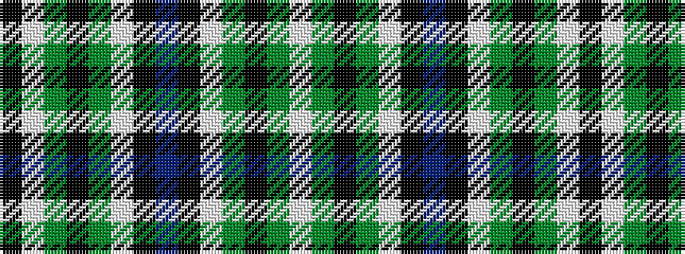

KWGKGWKBKWGKGW

It is a 14 stripe tartan.

<figure class="pat-woven">

<figcaption>idealised sample</figcaption>
</figure>

## Colour Sequence



## Tartans with this colour sequence

| Tartans |
|---------------|
| [Norwich No.115](/variants/s14/db10k6lt1g6k1g6lt1k6~x2/)|
||
