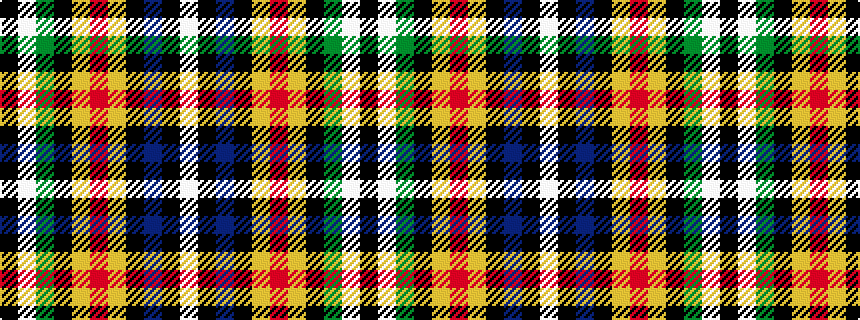

KWGKYRYKBKW

It is a 11 stripe tartan.

<figure class="pat-woven">

<figcaption>idealised sample</figcaption>
</figure>

## Colour Sequence



## Tartans with this colour sequence

| Tartans |
|---------------|
| [Braddock Family (Northumberland) (Personal)](/variants/s11/w5k4db2k5ly2r2ly2k30g3w7k4~x2/)|
||
