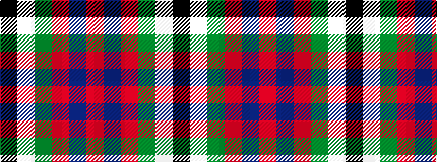

KWGRBR

It is a 6 stripe tartan.

<figure class="pat-woven">

<figcaption>idealised sample</figcaption>
</figure>

## Colour Sequence



## Tartans with this colour sequence

| Tartans |
|---------------|
| [Norris (1998)](/variants/s6/k2w1g5ri1t18r2~x2/)|
||
| [Norris (1998) (Name)](/variants/s6/k2w1g5r1t18r2~x2/)|
||
