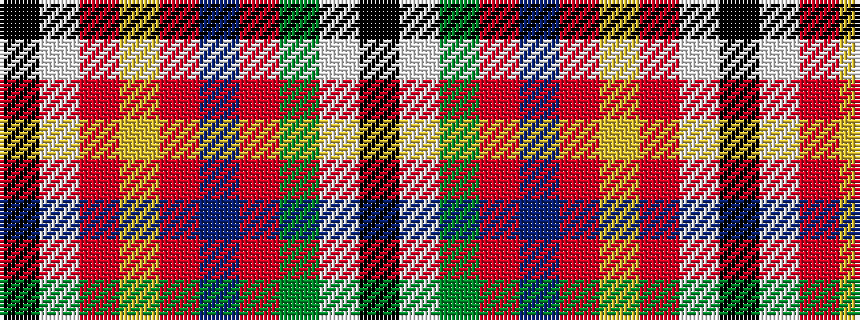

KWGRBRYRWK

It is a 10 stripe tartan.

<figure class="pat-woven">

<figcaption>idealised sample</figcaption>
</figure>

## Colour Sequence



## Tartans with this colour sequence

| Tartans |
|---------------|
| [Nassau County Firefighters (P&D)](/variants/s10/k13w13r26lo13r20dt13r26g22w13k13/)|
||
