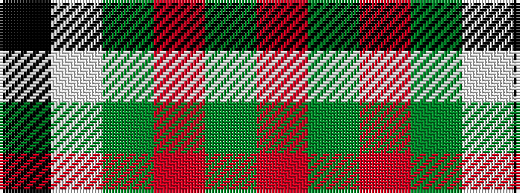

KWGRGR

It is a 6 stripe tartan.

<figure class="pat-woven">

<figcaption>idealised sample</figcaption>
</figure>

## Colour Sequence



## Tartans with this colour sequence

| Tartans |
|---------------|
| [MacGregor](/variants/s6/r35dg16r5dg5w2k3~x2/)|
||
| [MacGregor](/variants/s6/r35g16r5g5w2k3~x2/)|
||
