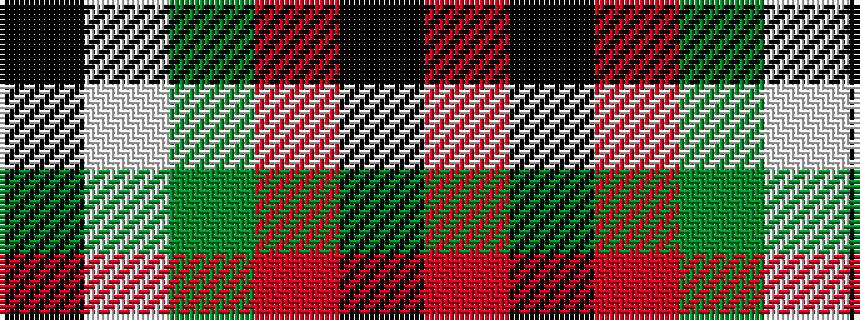

KWGRKR

It is a 6 stripe tartan.

<figure class="pat-woven">

<figcaption>idealised sample</figcaption>
</figure>

## Colour Sequence



## Tartans with this colour sequence

| Tartans |
|---------------|
| [Fraser Dress](/setts/s6/r6k14r6dg14w27k4/)|
||
| [Fraser, dress](/setts/s6/r6k14r6g14w27k4/)|
||
