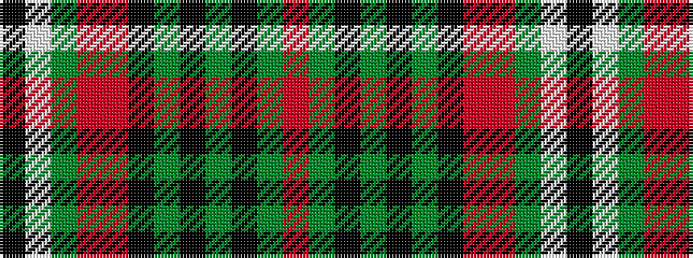

KWGRRKGKGKGR

It is a 12 stripe tartan.

<figure class="pat-woven">

<figcaption>idealised sample</figcaption>
</figure>

## Colour Sequence



## Tartans with this colour sequence

| Tartans |
|---------------|
| [Fullerton, Terence (Personal)](/setts/s12/m12g6k4g2k4g1k12m24r4g3w3k10~x2/)|
||
