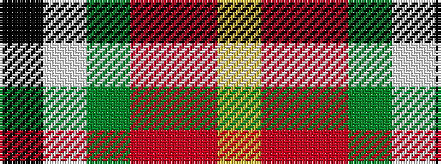

KWGRRY

It is a 6 stripe tartan.

<figure class="pat-woven">

<figcaption>idealised sample</figcaption>
</figure>

## Colour Sequence



## Tartans with this colour sequence

| Tartans |
|---------------|
| [Mason (Personal)](/variants/s6/k7w2dg2o31r35lo2~x2/)|
||
| [Mason, David Elsworth (Personal)](/variants/s6/k7w2dg2r31ri35lo2~x2/)|
||
