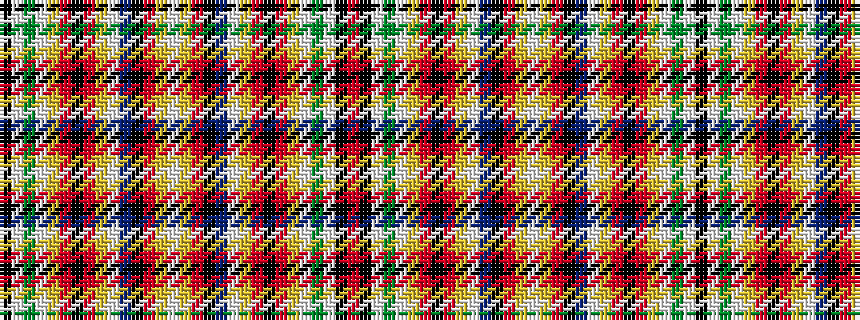

KWGWYRKRYWBKRYWYRKBWYRKRYWGWKR

It is a 30 stripe tartan.

<figure class="pat-woven">

<figcaption>idealised sample</figcaption>
</figure>

## Colour Sequence



## Tartans with this colour sequence

| Tartans |
|---------------|
| [Hong Kong Police Pipe Band](/variants/s30/r24k1w1dg6w1ly2r2k1r2ly2w1t6k2r3ly3w1~x2/)|
||
