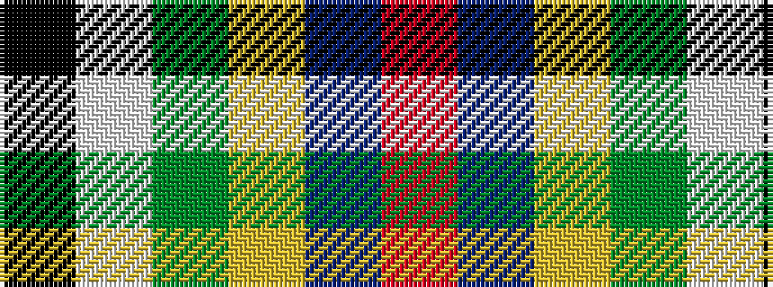

KWGYBR

It is a 6 stripe tartan.

<figure class="pat-woven">

<figcaption>idealised sample</figcaption>
</figure>

## Colour Sequence



## Tartans with this colour sequence

| Tartans |
|---------------|
| [Scottish American Society of Michigan (Official)](/variants/s6/r48t16lo5dg17w8k3~x2/)|
||
