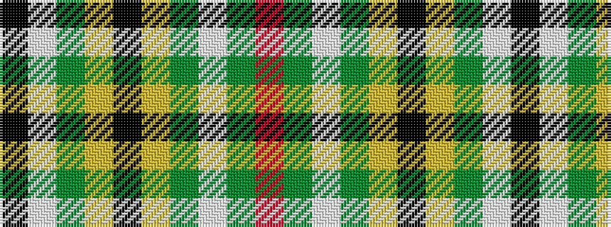

KWGYKYGWGR

It is a 10 stripe tartan.

<figure class="pat-woven">

<figcaption>idealised sample</figcaption>
</figure>

## Colour Sequence



## Tartans with this colour sequence

| Tartans |
|---------------|
| [Fiander, Julian (Personal)](/variants/s10/r6dg2w21dg2lo2k8lo2dg32w1k3~x2/)|
||
