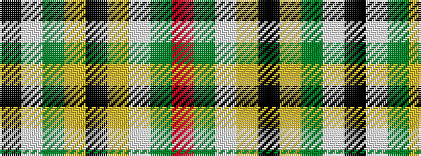

KWGYKYWGR

It is a 9 stripe tartan.

<figure class="pat-woven">

<figcaption>idealised sample</figcaption>
</figure>

## Colour Sequence



## Tartans with this colour sequence

| Tartans |
|---------------|
| [Fiander, Julian (Personal)](/setts/s9/r6g2w21ly2k8ly2g32w1k3~x2/)|
||
