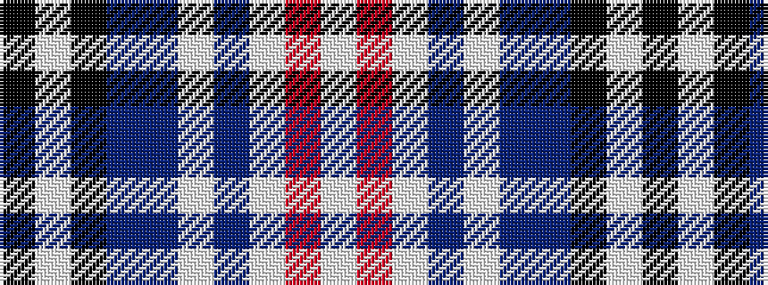

KWKBBWBWRW

It is a 10 stripe tartan.

<figure class="pat-woven">

<figcaption>idealised sample</figcaption>
</figure>

## Colour Sequence



## Tartans with this colour sequence

| Tartans |
|---------------|
| [Gemmell Blue (2001) (Personal)](/variants/s10/k5lb2k2b5db48lb7bi6lb2r2lb2~x2/)|
||
