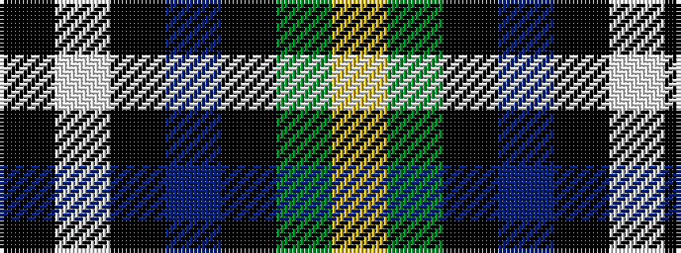

KWKBKGY

It is a 7 stripe tartan.

<figure class="pat-woven">

<figcaption>idealised sample</figcaption>
</figure>

## Colour Sequence



## Tartans with this colour sequence

| Tartans |
|---------------|
| [Presley of Lonmay](/variants/s7/k2lb25k2b8k2g28ly2~x2/)|
||
