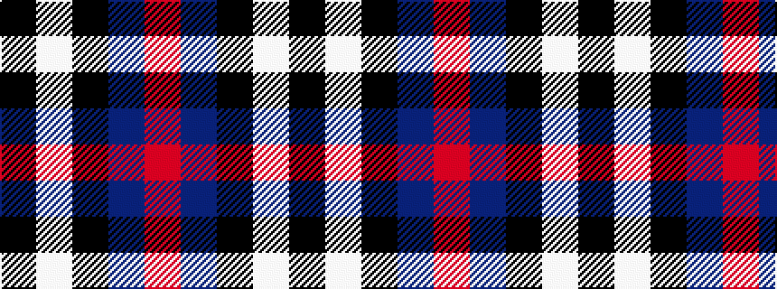

KWKBR

It is a 5 stripe tartan.

<figure class="pat-woven">

<figcaption>idealised sample</figcaption>
</figure>

## Colour Sequence



## Tartans with this colour sequence

| Tartans |
|---------------|
| [Edinburgh Crystal](/setts/s5/ki61w4k11db5m5~x2/)|
||
| [Greystone (Burberry Grey)](/setts/s5/k3lb3k3n10r1~x6/)|
||
