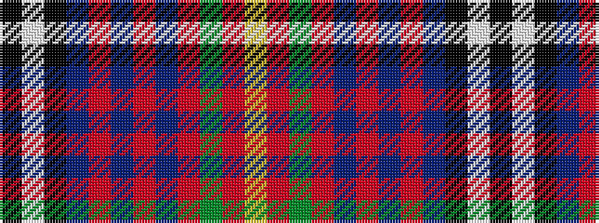

KWKBRBRBRGRY

It is a 12 stripe tartan.

<figure class="pat-woven">

<figcaption>idealised sample</figcaption>
</figure>

## Colour Sequence



## Tartans with this colour sequence

| Tartans |
|---------------|
| [Fowdar (Personal)](/variants/s12/k9w6k46db24r8db6r6db6r16g6r6ly6/)|
||
| [Fowdar (Personal)](/variants/s12/k9w6k46db24r8db6r6db6r16y6r6ly6/)|
||
