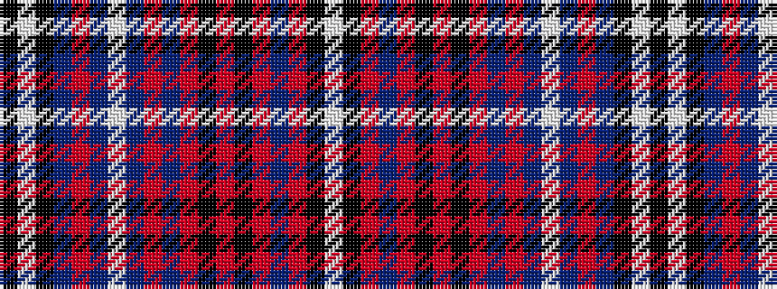

KWKBRBWBRBRKRKRBRKW

It is a 19 stripe tartan.

<figure class="pat-woven">

<figcaption>idealised sample</figcaption>
</figure>

## Colour Sequence



## Tartans with this colour sequence

| Tartans |
|---------------|
| [Un-named fashion (2013)](/variants/s19/k2w2k15dp5o5dp10lb2dp10o5dp5o30k2o4k2o30dp4o4k15w2~x2/)|
||
