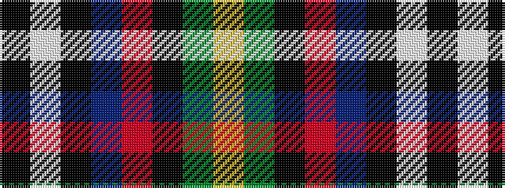

KWKBRKGY

It is a 8 stripe tartan.

<figure class="pat-woven">

<figcaption>idealised sample</figcaption>
</figure>

## Colour Sequence



## Tartans with this colour sequence

| Tartans |
|---------------|
| [Minnesota (District)](/variants/s8/k6w3k2db30r9k4g20ly3~x2/)|
||
| [Unidentified (Woven sample)](/variants/s8/k16w6k4b64m19k8g42ly6/)|
||
