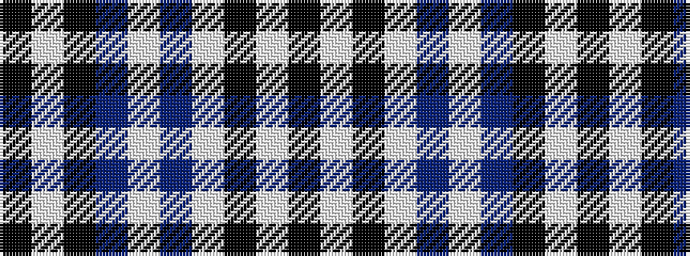

KWKBWBWKWK

It is a 10 stripe tartan.

<figure class="pat-woven">

<figcaption>idealised sample</figcaption>
</figure>

## Colour Sequence



## Tartans with this colour sequence

| Tartans |
|---------------|
| [Fraser, Arisaid](/variants/s10/k14w2k3w2dr10w32dr10k10w2k3~x2/)|
||
