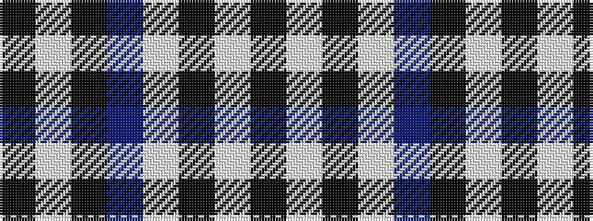

KWKBWKWK

It is a 8 stripe tartan.

<figure class="pat-woven">

<figcaption>idealised sample</figcaption>
</figure>

## Colour Sequence



## Tartans with this colour sequence

| Tartans |
|---------------|
| [London Fog Black (Fashion)](/setts/s8/k198lb9k17t13lb9k4lb13k4/)|
||
