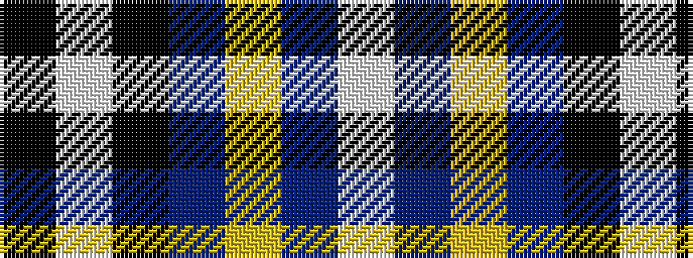

KWKBYBW

It is a 7 stripe tartan.

<figure class="pat-woven">

<figcaption>idealised sample</figcaption>
</figure>

## Colour Sequence



## Tartans with this colour sequence

| Tartans |
|---------------|
| [St. Johnstone F.C. (Sports)](/setts/s7/k6lb3k8db7lo2db7lb1~x4/)|
||
