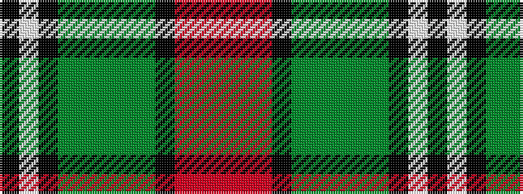

KWKGGGGGKRRR

It is a 12 stripe tartan.

<figure class="pat-woven">

<figcaption>idealised sample</figcaption>
</figure>

## Colour Sequence



## Tartans with this colour sequence

| Tartans |
|---------------|
| [Burns 250th Anniversary (Commem.)](/variants/s12/r8o2r24k6dy3g2dy3g2dy3k3w3k2~x2/)|
||
