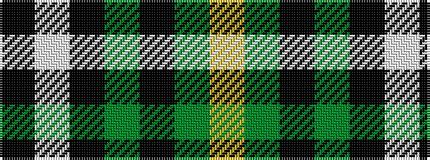

KWKGKGY

It is a 7 stripe tartan.

<figure class="pat-woven">

<figcaption>idealised sample</figcaption>
</figure>

## Colour Sequence



## Tartans with this colour sequence

| Tartans |
|---------------|
| [Lawson, William 2002](/setts/s7/k4w19k11dg15k3dg16ly3~x2/)|
||
| [Lawsons' Whisky](/setts/s7/k9w38k22g31k5g31ly5/)|
||
