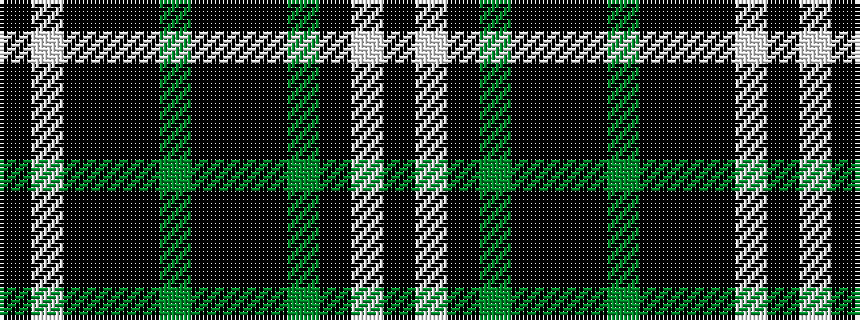

KWKGKKKGKKKWK

It is a 13 stripe tartan.

<figure class="pat-woven">

<figcaption>idealised sample</figcaption>
</figure>

## Colour Sequence



## Tartans with this colour sequence

| Tartans |
|---------------|
| [Chess](/setts/s13/k1w1k8k1k1dg8k1k8k1dg1k8w1k1~x6/)|
||
