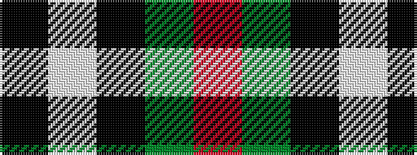

KWKGR

It is a 5 stripe tartan.

<figure class="pat-woven">

<figcaption>idealised sample</figcaption>
</figure>

## Colour Sequence



## Tartans with this colour sequence

| Tartans |
|---------------|
| [Burberry Hunting](/setts/s5/k3w3k3y10r1~x6/)|
||
| [Oban Grey](/setts/s5/k4w3k4y9r1~x4/)|
||
