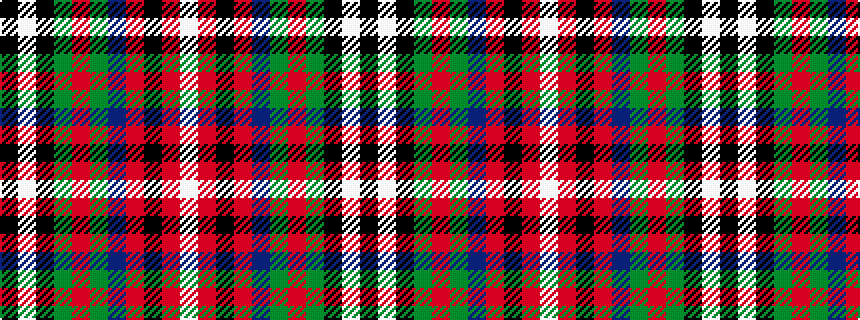

KWKGRGBRKRW

It is a 11 stripe tartan.

<figure class="pat-woven">

<figcaption>idealised sample</figcaption>
</figure>

## Colour Sequence



## Tartans with this colour sequence

| Tartans |
|---------------|
| [Hohenzollern](/variants/s11/k1w31k4g8r1g2dt7r4k1r4w1~x2/)|
||
