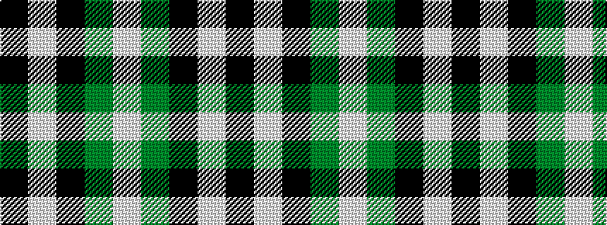

KWKGW

It is a 5 stripe tartan.

<figure class="pat-woven">

<figcaption>idealised sample</figcaption>
</figure>

## Colour Sequence



## Tartans with this colour sequence

| Tartans |
|---------------|
| [Glen Coe #1 (Fashion)](/variants/s5/k37w9k3g9w3~x2/)|
||
| [Glen Coe Trade Tartan](/variants/s5/k37w9k3dg9w3~x2/)|
||
