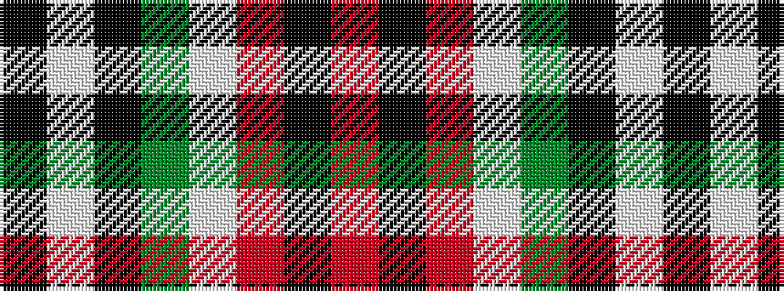

KWKGWRKR

It is a 8 stripe tartan.

<figure class="pat-woven">

<figcaption>idealised sample</figcaption>
</figure>

## Colour Sequence



## Tartans with this colour sequence

| Tartans |
|---------------|
| [Raytheon](/setts/s8/k14w2k3y14wi6r14k2r3~x2/)|
||
