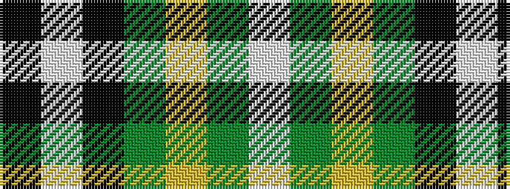

KWKGYGW

It is a 7 stripe tartan.

<figure class="pat-woven">

<figcaption>idealised sample</figcaption>
</figure>

## Colour Sequence



## Tartans with this colour sequence

| Tartans |
|---------------|
| [St Johnstone F.C.](/setts/s7/k19w8k19g16ly4g16w2~x2/)|
||
