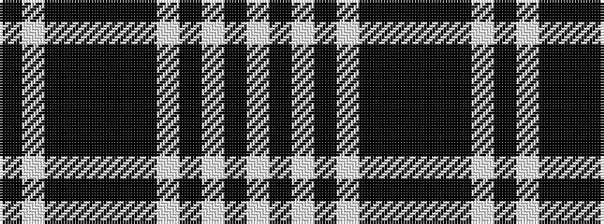

KWKKKKKWKWKW

It is a 12 stripe tartan.

<figure class="pat-woven">

<figcaption>idealised sample</figcaption>
</figure>

## Colour Sequence



## Tartans with this colour sequence

| Tartans |
|---------------|
| [YMCA Corporate Tartan](/variants/s12/k4w1k36k4ki1k3ki10w1k4w1ki8w1~x2/)|
||
