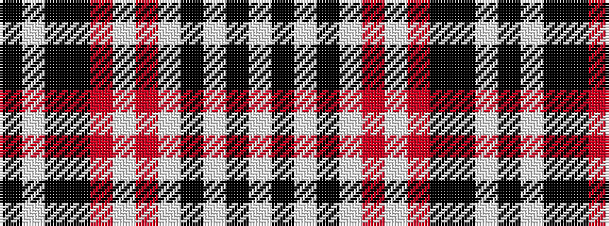

KWKKRWRWKWKW

It is a 12 stripe tartan.

<figure class="pat-woven">

<figcaption>idealised sample</figcaption>
</figure>

## Colour Sequence



## Tartans with this colour sequence

| Tartans |
|---------------|
| [Auld Lang Syne, Grey (Fashion)](/setts/s12/k4w2k9k3r3w3r3w23k10w2k6w2~x2/)|
||
