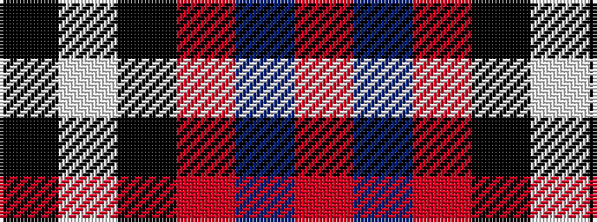

KWKRBR

It is a 6 stripe tartan.

<figure class="pat-woven">

<figcaption>idealised sample</figcaption>
</figure>

## Colour Sequence



## Tartans with this colour sequence

| Tartans |
|---------------|
| [Ramsay](/setts/s6/k4lb2k28r30db1r3~x2/)|
||
| [Ramsay](/setts/s6/k4w2k28r30dp1r3~x2/)|
||
| [Ramsay (Red)](/setts/s6/k4w1k28r30dp1r3~x2/)|
||
