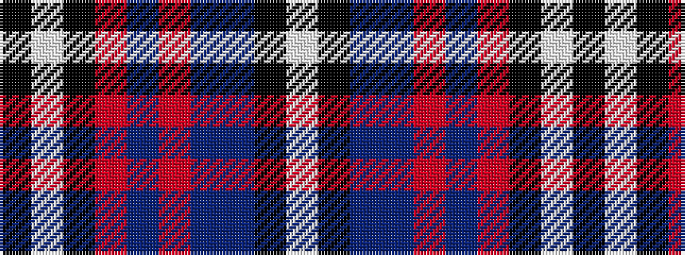

KWKRBRBBKW

It is a 10 stripe tartan.

<figure class="pat-woven">

<figcaption>idealised sample</figcaption>
</figure>

## Colour Sequence



## Tartans with this colour sequence

| Tartans |
|---------------|
| [Unidentified](/setts/s10/k4w3k3r13db24r8db26t12k3w2~x2/)|
||
