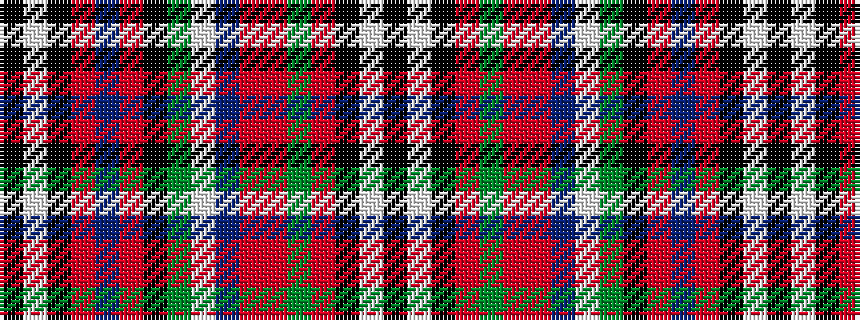

KWKRBRKGWBRRGRKWK

It is a 17 stripe tartan.

<figure class="pat-woven">

<figcaption>idealised sample</figcaption>
</figure>

## Colour Sequence



## Tartans with this colour sequence

| Tartans |
|---------------|
| [Brinkie's Brae (Personal)](/setts/s17/k3w4k3r18db1o18k1g18w1db18r1o18g1r18k3w4k3~x2/)|
||
