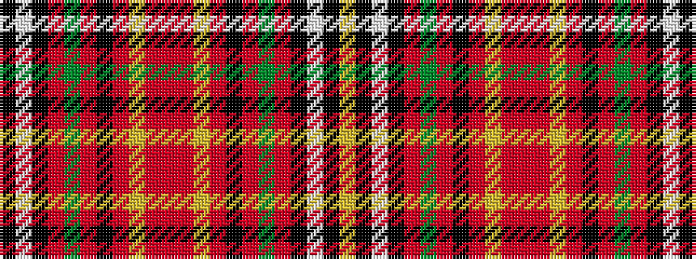

KWKRGRKRYRRRYRKRGRKWKY

It is a 22 stripe tartan.

<figure class="pat-woven">

<figcaption>idealised sample</figcaption>
</figure>

## Colour Sequence



## Tartans with this colour sequence

| Tartans |
|---------------|
| [West Lothian Woolen Mill](/setts/s22/k34w2k2o27g1o2k3o2ly1o2r2o2ly1o2k3o2g1o27k2w2k34lo2~x2/)|
||
