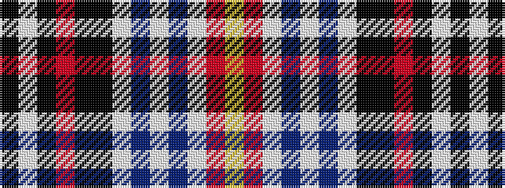

KWKRKKWBWBWRY

It is a 13 stripe tartan.

<figure class="pat-woven">

<figcaption>idealised sample</figcaption>
</figure>

## Colour Sequence



## Tartans with this colour sequence

| Tartans |
|---------------|
| [Boyd (Clan)](/setts/s13/k5w4k4r5k35k4w10db2w2db2w2r22ly5~x2/)|
||
