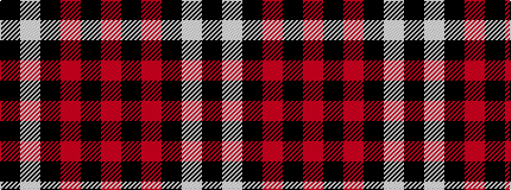

KWKRKR

It is a 6 stripe tartan.

<figure class="pat-woven">

<figcaption>idealised sample</figcaption>
</figure>

## Colour Sequence



## Tartans with this colour sequence

| Tartans |
|---------------|
| [Hakkarain (Personal)](/variants/s6/ki37w18k37r2k2r2~x2/)|
||
| [Knights Breton](/variants/s6/r19k8r18k50w14k6/)|
||
| [Ramsay of Dalhousie](/variants/s6/k4w2k28r30k1r3~x2/)|
||
